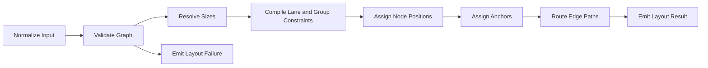

# Directional Lane Layout Library Design

## 1. Purpose

This library lays out directed node graphs with these properties:

- Nodes are assigned to caller-defined horizontal lanes.
- Nodes may be grouped into caller-defined left-to-right group blocks.
- Edges may cross group boundaries.
- The graph must obey a strict left-to-right directional structure.
- The library accepts default node sizes and optional measured node sizes.
- The library returns node positions, lane positions, group bounds, and routed edge paths with anchor points.
- Invalid inputs such as cycles, back-edges, or contradictory group flow are rejected.

This library does not contain any domain-specific concepts beyond nodes, edges, lanes, and groups.

## 2. Design Goals

Hard rules:

- Preserve caller-provided lane assignment.
- Preserve caller-provided lane order.
- Preserve caller-provided group order.
- Enforce strict left-to-right edge ordering.
- Enforce a minimum horizontal shift between each source node and target node.
- Keep every node inside exactly one group when groups are used.
- Keep nodes of a group adjacent as one horizontal block.
- Prevent any node outside a group from overlapping that group's bounding box.
- Reject cycles, back-edges, and bidirectional group flow.
- Produce anchor assignments such that no two edges share an anchor point on a node.
- Minimize edge crossings within the space allowed by the hard rules.

Non-goals:

- Automatic lane assignment
- Automatic group discovery
- Support for cyclic graphs
- Domain-specific node semantics
- Arbitrary edge attachment policies beyond the defined directional anchor rules

## 3. Core Model

### 3.1 Input Model

`LayoutRequest`

- `nodes: NodeInput[]`
- `edges: EdgeInput[]`
- `lanes: LaneInput[]`
- `groups?: GroupInput[]`
- `defaults: DefaultSizeOptions`
- `spacing?: SpacingOptions`

`NodeInput`

- `id: string`
- `laneId: string`
- `groupId?: string`
- `width?: number`
- `height?: number`

`EdgeInput`

- `id: string`
- `sourceId: string`
- `targetId: string`

`LaneInput`

- `id: string`
- `order: number`

`GroupInput`

- `id: string`
- `order: number`

`DefaultSizeOptions`

- `nodeWidth: number`
- `nodeHeight: number`

`SpacingOptions`

- `groupGap?: number`
- `minTargetShift?: number`

### 3.2 Derived Model

The solver should normalize input into:

- resolved node sizes
- lanes ordered by `lane.order`
- groups ordered by `group.order`
- a directed acyclic graph
- per-node incoming and outgoing edge sets
- per-group node membership
- inter-group flow matrix
- edge orientation derived from the relative lane order of each edge's endpoints

### 3.3 Output Model

`LayoutResult`

- `nodes: NodeLayout[]`
- `lanes: LaneLayout[]`
- `groups?: GroupLayout[]`
- `edges: EdgeLayout[]`

`NodeLayout`

- `id: string`
- `x: number`
- `y: number`
- `width: number`
- `height: number`

`LaneLayout`

- `id: string`
- `top: number`

`GroupLayout`

- `id: string`
- `x: number`
- `y: number`
- `width: number`
- `height: number`

`EdgeLayout`

- `id: string`
- `sourceId: string`
- `targetId: string`
- `sourceAnchor: AnchorPoint`
- `targetAnchor: AnchorPoint`
- `points: Point[]`

`AnchorPoint`

- `x: number`
- `y: number`
- `side: "top" | "right" | "bottom" | "left"`
- `ordinal: number`

`LayoutFailure`

- `type`
- `message`
- `details`

## 4. Validity Rules

The library must reject input before layout if any of these are true:

- a node references a missing lane
- a node references a missing group
- groups are present and any node has no group
- a lane order is duplicated
- a group order is duplicated
- an edge references a missing node
- the graph contains a cycle
- an edge violates topological left-to-right order
- any pair of groups has flow in both directions
- any node would require placement outside its assigned group
- the lane relationship of an edge is incompatible with the anchor rules

The library should return structured failures such as:

- `InvalidReference`
- `MissingGroupAssignment`
- `CycleDetected`
- `BackEdgeDetected`
- `BidirectionalGroupFlow`
- `UnsatisfiableConstraints`

## 5. Layout Semantics

### 5.1 Lanes

- Lanes are horizontal rows.
- The caller defines lane order by `lane.order`.
- Lower `lane.order` values are visually higher.
- A node's vertical position is determined by its assigned lane only.
- Nodes in different lanes may overlap horizontally.
- Nodes in the same lane must respect left-to-right ordering.

### 5.2 Groups

- Groups are ordered left to right by caller input.
- A group is a contiguous horizontal region containing all of its nodes.
- A group may contain nodes in multiple lanes.
- The group's bounding box spans every lane occupied by its nodes.
- No node outside the group may overlap the group's bounding box.
- If groups exist, every node must belong to exactly one group.
- Adjacent groups must be separated by at least `spacing.groupGap`.

### 5.3 Directed Order

- All edges express forward flow.
- For every edge, the source must be placed left of the target.
- The target node origin must be at least `spacing.minTargetShift` units to the right of the source node origin.
- The layout must not produce visual backtracking.
- Group ordering is also directional: if any edge flows from group A to group B, then A must be left of B.
- If edges imply both A -> B and B -> A, the request is invalid.

### 5.4 Node Sizes

- Each node uses measured `width` and `height` when provided.
- Missing measurements fall back to defaults.
- Layout must be deterministic for the same normalized input.

## 6. Edge and Anchor Rules

### 6.1 Edge Orientation

Edge orientation is derived from lane order:

- if source lane order equals target lane order, the edge is `side`
- if target lane order is less than source lane order, the edge is `up`
- if target lane order is greater than source lane order, the edge is `down`

### 6.2 Anchor Sides

Anchor side selection is fixed by derived edge orientation:

- `side`: source attaches on `right`, target attaches on `left`
- `up`: source attaches on `top`, target attaches on `left`
- `down`: source attaches on `bottom`, target attaches on `top`

### 6.3 Anchor Uniqueness

- No two edges may share the same anchor point on the same node.
- Multiple edges on the same side must receive distinct anchor ordinals.
- Anchor positions on a side must be ordered to minimize crossings.

### 6.4 Edge Paths

- Edge paths must start at the resolved source anchor and end at the resolved target anchor.
- Paths may cross group boundaries.
- Paths should minimize crossings and unnecessary shared horizontal segments.
- Paths must respect node and group geometry.
- The library should return explicit polyline points.

## 7. Rule Catalog

### 7.1 Ungrouped Graphs

Required behavior:

- preserve lane assignment
- preserve left-to-right flow
- enforce the minimum source-to-target horizontal shift
- minimize crossings within and across lanes
- return lane positions, node positions, and edge anchors and paths
- reject cycles and back-edges

### 7.2 Grouped Graphs

Required behavior:

- preserve caller-provided group order
- place each group as a separate horizontal block
- keep all nodes of a group adjacent inside that block
- allow edges to cross from one group to another
- reject bidirectional flow between the same pair of groups
- preserve lane assignment across the whole diagram
- allow horizontal overlap only across different lanes, not through foreign group bounds
- return lane positions and group bounds in addition to node and edge layout

## 8. Layout Pipeline



The pipeline should be deterministic and single-directional. Validation must happen before any expensive solve work.

## 9. API Contract

Recommended top-level API:

```ts
type LayoutResponse =
  | { ok: true; result: LayoutResult }
  | { ok: false; error: LayoutFailure };

declare function layout(request: LayoutRequest): LayoutResponse;
```

Behavioral contract:

- pure function over input data
- deterministic output for equivalent normalized input
- no hidden measurement phase inside the library
- caller is responsible for supplying measured sizes when available

## 10. Failure Modes

The library must fail fast and explicitly for:

- cyclic node graph
- back-edge relative to the required directional ordering
- missing lane, node, or group references
- partial group assignment when groups are enabled
- duplicate lane orders or group orders
- contradictory inter-group direction
- unsatisfiable anchor assignment
- unsatisfiable placement constraints under the hard rules

Error payloads should identify:

- the failing rule
- the involved node ids, edge ids, lane ids, or group ids
- whether the failure is structural or geometric

## 11. Implementation Guidance for a Future Agent

A future implementation should treat these as separate concerns:

- structural validation
- geometric constraint solving
- anchor assignment
- edge routing
- failure reporting

The implementation should not weaken hard rules in order to improve aesthetics. Crossing minimization is an optimization goal inside the valid solution space, not a reason to violate lane, group, or directional constraints.
